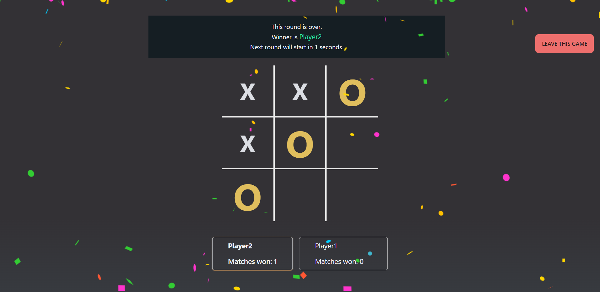

# Tic Tac Toe - client

## Table of Contents

* [Links](#links)
* [Overview](#overview)
  * [Built With](#built-with)
* [Features](#features)
* [How to use](#how-to-use)
* [Contact](#contact)
* [Acknowledgements](#acknowledgements)

## Links

* [Live App](https://tic-tac-toe-multiplayer-client.vercel.app/)
* [GitHub](https://github.com/nkp1111/tic-tac-toe-multiplayer)

## Overview



## Features

* connects to server with socket
* allow player vs player mode
* player vs computer mode

## Built With

* Vite
* React.js
* Typescript
* TailwindCSS

## How To Use

To clone and run this application, you'll need [Git](https://git-scm.com) and [Node.js](https://nodejs.org/en/download/) (which comes with [npm](http://npmjs.com)) installed on your computer. From your command line:

```bash
# Clone this repository
$ git clone https://github.com/nkp1111/tic-tac-toe-multiplayer.git

# Go to project directory
$ cd tic-tac-toe-multiplayer/client

# Install dependencies
$ npm install

# Run the app
$ npm run dev

```

Open [localhost:5173](http://localhost:5173) with your browser to see the result.

## Acknowledgements

* tailwind - for applying styles
* daisyui - for tailwind component
* socket.io-client
* react-router-dom
* react-use
* react-icons
* react-confetti
* react-hot-toast

## Contact

* Neeraj Parmar
* GitHub [nkp1111](https://github.com/nkp1111)
* LinkedIn [neeraj](https://www.linkedin.com/in/neeraj-parmar-058591244/)
* Twitter [@nkp11111507](https://twitter.com/@nkp11111507)
